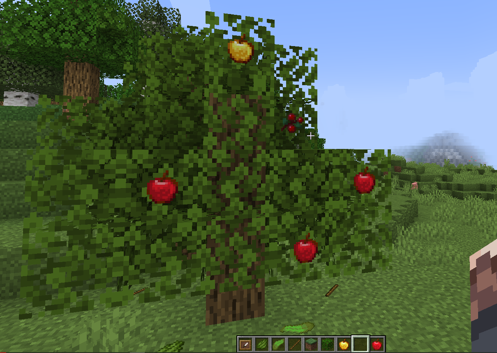
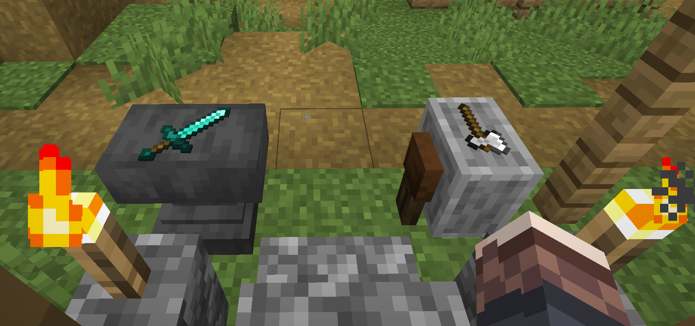
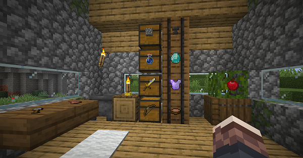

## **ItemFrameToggle**
#### *Easily toggle visibility of item frames and remove collision*
---

This plugin is fork of [ItemFrameToggle](https://www.spigotmc.org/resources/itemframetoggle.81318/) which is no longer supported by its owner.

Very simple item frame visibility toggle. Sneak and right click an item frame to toggle.

Controls:

Sneak and right click: Set item frame to visible/invisible

Once you set an item frame invisible, and it is in front of any kind of container, controls of it changes a little bit to improve playing fun.

Right click: Access to the container at the behind of item frame
(Chests, barrels, furnaces, hoppers, dispensers, droppers, shulkers)
Left click: Kill item inside of itemframe
Sneak and left click: rotate item
Sneak and right click: set item frame visible

Permissions:
itemframetoggle.toggle - enabled by default.

